# 🖼️ Expected Outputs — Does Yours Match?

> Run your program, then compare with the picture here. It won't be *pixel-perfect*
> (your colours or sizes may differ) — but the **shape** should look like this. ✅
> If it looks very different, check the **Debugging Corner** in that session's notes.

🏠 [Back to Home](README.md)

## Session 1 — First Turtle

<table>
<tr><td align="center" width="33%"> <b>Square</b></td><td align="center" width="33%">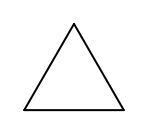 <b>Triangle</b></td><td align="center" width="33%">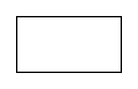 <b>Rectangle</b></td></tr>
<tr><td align="center" width="33%">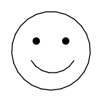 <b>Happy Face</b></td></tr>
</table>

## Session 2 — Pen & Loops

<table>
<tr><td align="center" width="33%">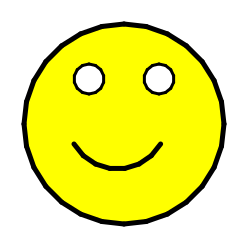 <b>Smiley Face</b></td><td align="center" width="33%">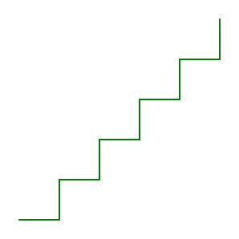 <b>Staircase</b></td><td align="center" width="33%">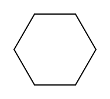 <b>Hexagon (6 sides)</b></td></tr>
<tr><td align="center" width="33%">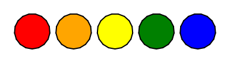 <b>Colourful Circle Row</b></td></tr>
</table>

## Session 3 — If/Else

<table>
<tr><td align="center" width="33%">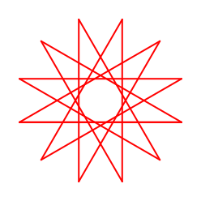 <b>Spiral Pattern (range 13, left 150)</b></td><td align="center" width="33%"> <b>Traffic Light (one filled circle)</b></td></tr>
</table>

## Session 4 — Loops Deep Dive

<table>
<tr><td align="center" width="33%">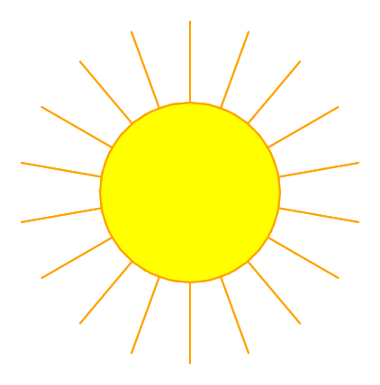 <b>The Sun</b></td><td align="center" width="33%">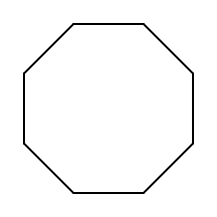 <b>Octagon (8 sides)</b></td></tr>
</table>

## Session 5 — Functions & Map

<table>
<tr><td align="center" width="33%">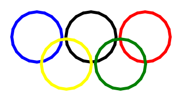 <b>Olympic Rings</b></td><td align="center" width="33%">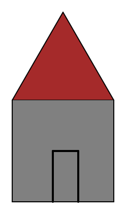 <b>House</b></td><td align="center" width="33%">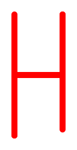 <b>Letter H</b></td></tr>
<tr><td align="center" width="33%">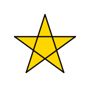 <b>A Star</b></td></tr>
</table>

## Session 6 — Random & Final

<table>
<tr><td align="center" width="33%">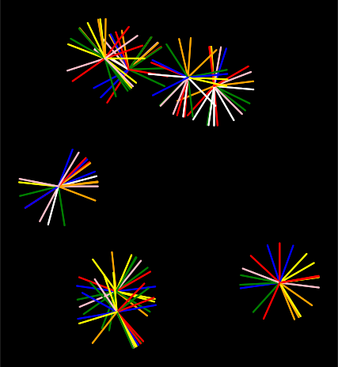 <b>Fireworks</b></td><td align="center" width="33%">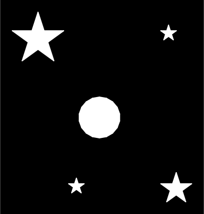 <b>Full Moon Sky</b></td><td align="center" width="33%">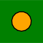 <b>Moving Ball (one frame)</b></td></tr>
</table>

## Session 7 — Racing Game

<table>
<tr><td align="center" width="33%">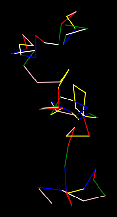 <b>Random Walk</b></td><td align="center" width="33%">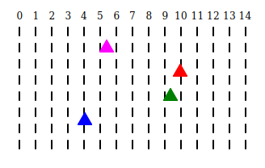 <b>Turtle Racing Game</b></td></tr>
</table>
